[中文文档](doc/cn/README.md)

## 1 System Overview

### 1.1 Main functions

Use a Mid-40 LiDAR with a detection distance of 260m, an accuracy of 2cm, and a non-repetitive scanning pattern, combined with the high-precision position and attitude data provided by the APX-15 inertial navigation module, to enable real-time high-precision mapping.

The following picture is the real-time construction effect:


The following picture is the full effect:

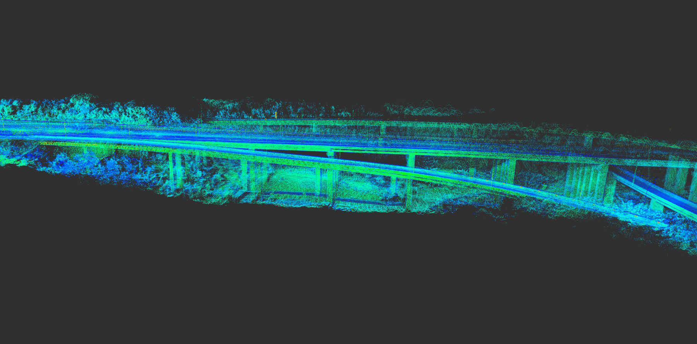

### 1.2 System Block Diagram

The whole system contains the following main modules. The connection and data interaction of each module are shown in the following figure:

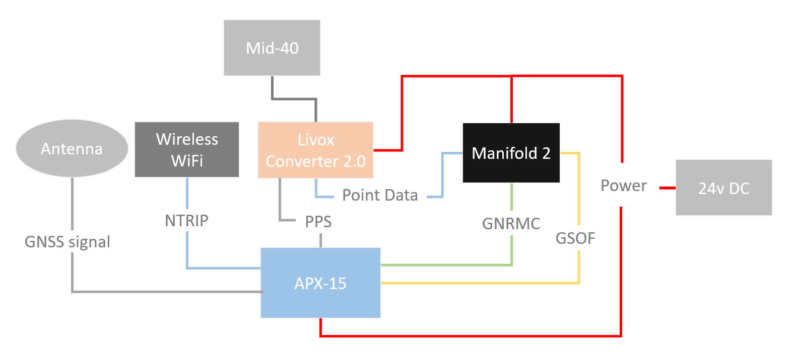

The interface and purpose of the above data link:

GNSS signal: GPS antenna, providing satellite signals to APX-15;

NTRIP: Network interface, used for NTRIP data of the network RTK service between the wireless network module and APX-15;

PPS: TTL level interface, provides hardware time synchronization signal to Mid-40;

Point Data: Manifold and Livox Converter 2.0 box transmit Mid-40 point cloud data through the network port;

GNRMC: USB to RS232 level, connect to Manifold, provide Mid-40 with the time information corresponding to each PPS pulse;

GSOF: USB to TTL level, connect to Manifold, transmit the attitude and position data output by APX-15;

Power: Use 24v DC power supply to power Manifold, Mid-40, APX-15;

## 2 Hardware System

Start from here we will introduce how to complete the hardware to build the entire system, and complete the configuration of related modules.

### 2.1 Hardware List

First of all, you need to prepare the following hardware modules. The remarks have descriptions and links of related products.

| Name                    | Number | Remark                                                       |
| ----------------------- | ------ | ------------------------------------------------------------ |
| APX-15                  | 1      | [APX-15 UAV](https://www.applanix.com/products/dg-uavs.htm)  |
| GNSS Antenna            | 1      | Support frequency band: GPS+GLONASS+BeiDou+Galileo           |
| USB to TTL/RS232 module | 2      | Support USB to TTL level or RS232 level, [CP2102 multi-function module](https://detail.tmall.com/item.htm?spm=a1z10.3-b-s.w4011-16538328900.25.69553d6c5zYQpq&id=41297073849&rn=4082524dc57b58372596ac3cccfd4555&abbucket=11) |
| Manifold 2              | 1      | NVIDIA Jetson TX2 core, [Manifold 2-G](https://www.dji.com/cn/manifold-2) |
| Mid-40                  | 1      | It is recommended to use the short cable version, [Mid-40](https://www.livoxtech.com/cn/mid-40-and-mid-100) |
| Livox Converter 2.0     | 1      | 9~30v power input, TTL level synchronization interface, non-Mid-40 original converter box, [Included in Horizon products](https://www.livoxtech.com/cn/horizon) |
| Wireless Network Module | 1      | Connect outdoor 3G/4G signal with RJ45 interface, [Huawei WiFi 2 Pro](https://consumer.huawei.com/cn/routers/mobilewifi2pro/) |

*Remarks:*

- USB to TTL/RS232 module: Because the signal output by COM1 of APX-15 is RS232 level and the signal output by COM3 is 3.3v TTL level, we need a USB to TTL module and a USB to RS232 module respectively;
- Manifold 2: can be replaced by other small miniPCs, if you want to install on multi-rotor aircraft, you need to consider power supply and weight;
- Mid-40: Because the entire system needs to be compactly assembled together, it is recommended to use the short cable version of Mid-40. To purchase the short line version, you need to contact the Livox official sales staff;
- **Livox Converter 2.0**: If you use Mid-40's own adapter box (Livox Converter 1.0, 10~16v power input, 485 level synchronization interface), you need to use a DC-DC module to convert a 24v power supply voltage to 12v, and a module that converts TTL to 485 level, to convert the APX PPS signal to 485 level, and then accesses the synchronization interface. Livox Converter 2.0 is a module included in Horizon/Tele products. If you purchase separately, you need to contact the official sales staff of Livox;
- Wireless Network Module: Provide network RTK connection service for APX. Because APX uses wired Ethernet interface, the network module needs to be equipped with RJ45 wired interface;

### 2.2 Connection and configuration

The whole system has 3 core modules, which are:

1. Mid-40
2. Manifold/miniPC
3. APX-15

The next part will introduce their connections in system, and functional configuration.

#### 2.2.1 Mid-40

One end of the Livox Converter box is connected to Mid-40, and the other end has 3 interfaces:

Power supply: connect 24v power supply;

Network port: network cable connects to Manifold 2;

Synchronization interface: the blue part of the synchronization signal line is connected to the APX PPS signal output port (PIN13), and the black part is connected to the APX GND port (PIN12);

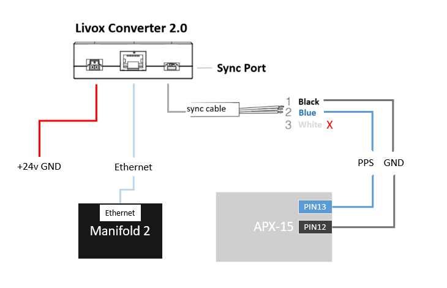

#### 2.2.2 Manifold/miniPC

Power supply: connect 24v power supply;

Network port: network cable connected to Livox Converter 2.0;

USB to RS232 module: RS232 Rx is connected to APX-15 COM1 Tx (PIN20), RS232 GND is connected to APX-15 GND (PIN12);

USB to TTL module: TTL Rx is connected to APX-15 COM3 Tx (PIN22), TTL GND is connected to APX-15 GND (PIN12);

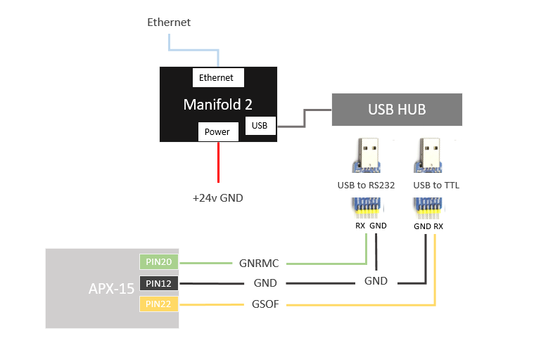

#### 2.2.3 APX-15

MMCX interface: connect GNSS antenna

PIN12: GND

PIN13: output PPS signal

PIN20: COM1 Tx, output GNRMC data

PIN22: COM3 Tx, output GSOF INS Full Navigation Info data

PIN27 / 29/31/33: RJ45 wired network interface, used to transmit network RTK service data

PIN42: Power GND

PIN44: power +24v input

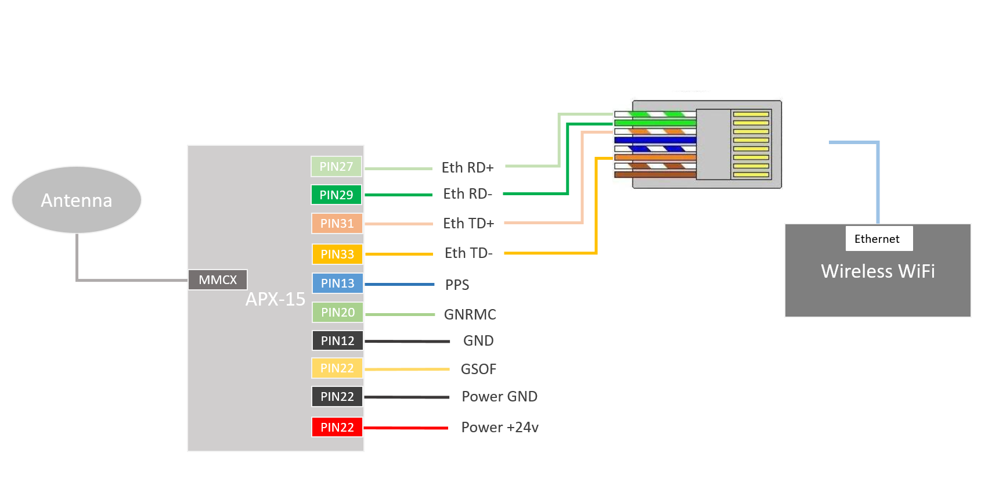

In order to enable APX-15 COM1 to output GNRMC data and COM3 to output GSOF data, it is necessary to configure the type and frequency of the corresponding IO output data in the APX-15 management interface (login through a browser). At the same time, in order to use the network RTK service, the NTRIP client account of the network RTK service needs to be added on the corresponding page.

COM1 output configuration:

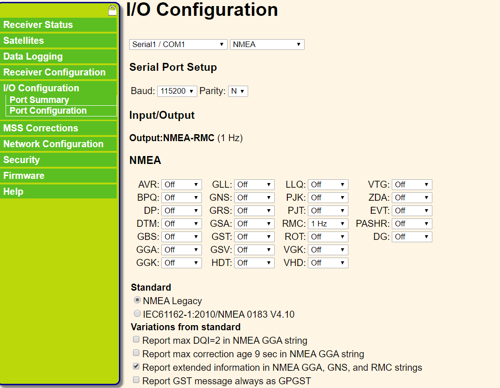

COM3 (displayed as COM2 in the management interface) output configuration:


Add NTRIP client account:

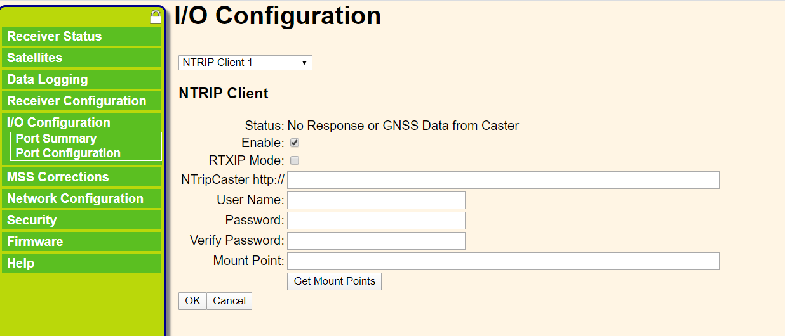

### 2.3 Assembly and commissioning

According to the above introduction, after completing the corresponding hardware connection and interface configuration, install each module as compactly as possible in the following manner:

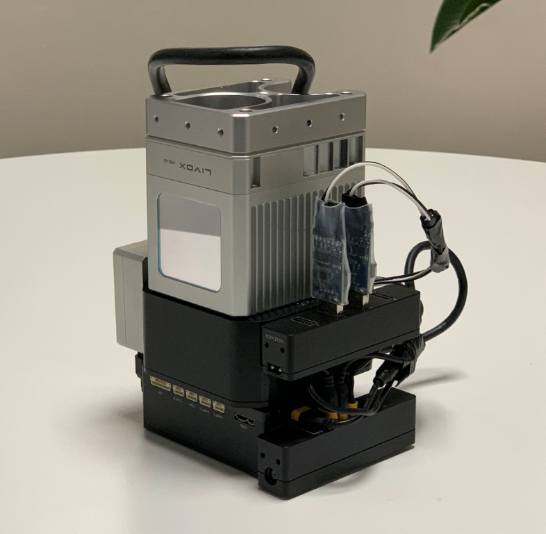

Relative coordinates between imu and LiDAR in assembly:

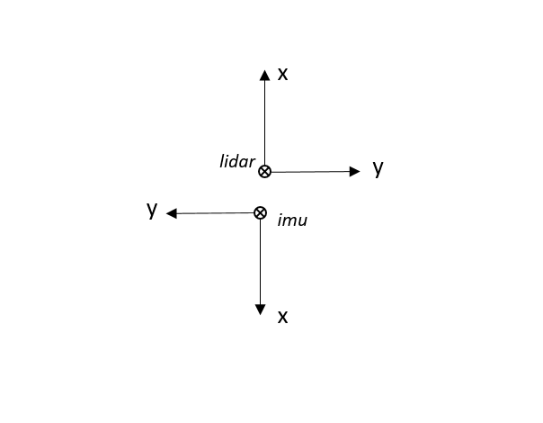

Effect picture installed on the drone:

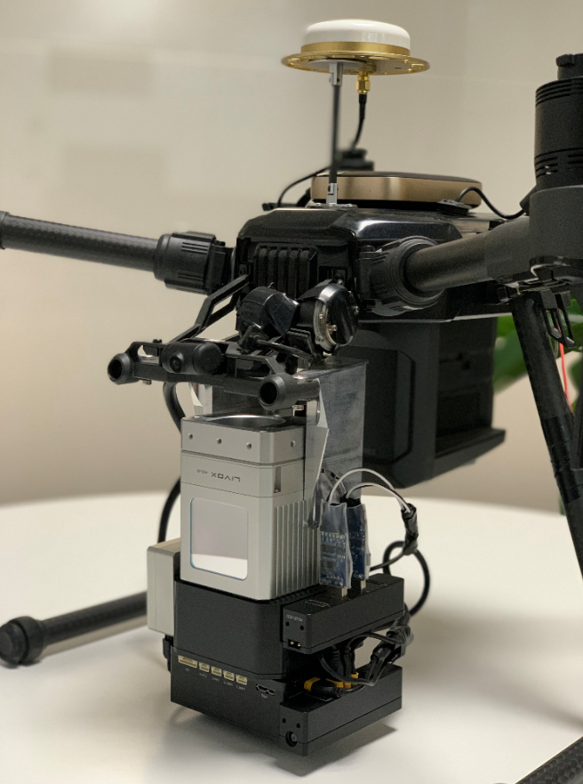

The real installation is shown in the above figure, because LiDAR and imu are installed closely, we do not need to configure the translation parameter between them, but the distance between the imu and GNSS antenna is relatively far, we need to configure this translation parameter:

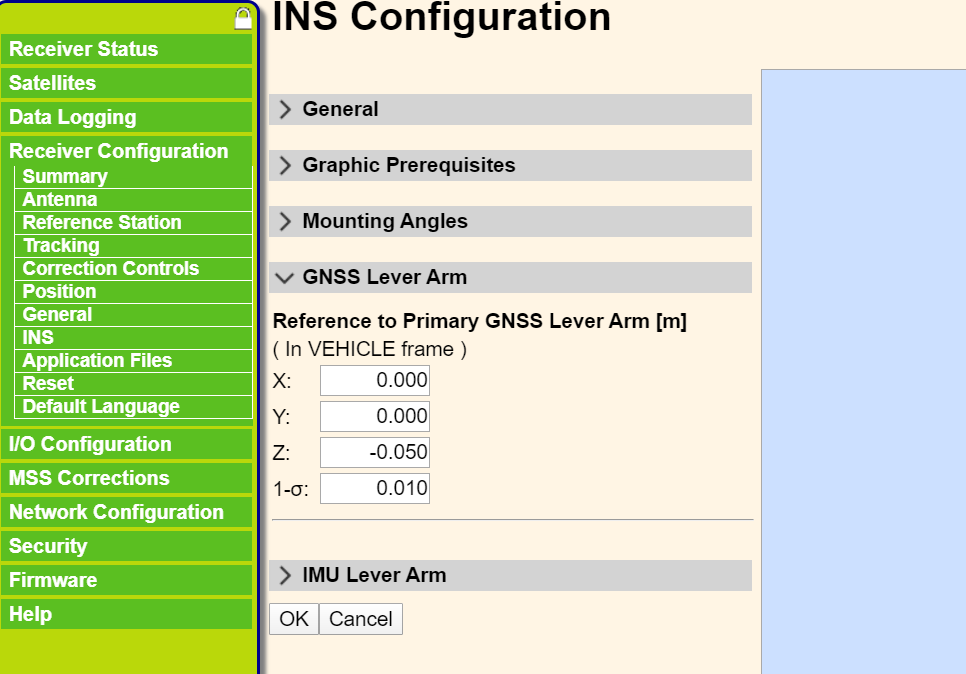

## 3 Software

### 3.1 Download and Install

The following test is based on Ubuntu 64-bit 16.04 environment.

1. Install [Livox SDK](https://github.com/Livox-SDK/Livox-SDK) and [livox_ros_driver](https://github.com/Livox-SDK/livox_ros_driver), if installed, you can skip this step:

```
# Install Livox_SDK
git clone https://github.com/Livox-SDK/Livox-SDK.git
cd Livox-SDK
sudo ./third_party/apr/apr_build.sh
cd build && cmake ..
make
sudo make install

# Install livox_ros_driver
git clone https://github.com/Livox-SDK/livox_ros_driver.git ws_livox/src
cd ws_livox
catkin_make
```

2. Install PCL, Eigen dependencies:

- [PCL](http://www.pointclouds.org/downloads/linux.html)
- [Eigen](http://eigen.tuxfamily.org/index.php?title=Main_Page)

3. Install [livox_high_precision_mapping](https://github.com/Livox-SDK/livox_high_precision_mapping):

```
cd ws_livox/src
git clone https://github.com/Livox-SDK/livox_high_precision_mapping.git
cd ws_livox
catkin_make
source ./devel/setup.sh
```

### 3.2 Software Configuration

**LiDAR Configuration**

In the [livox_ros_driver/config/livox_lidar_config.json](https://github.com/Livox-SDK/livox_ros_driver/blob/master/livox_ros_driver/config/livox_lidar_config.json) file, add Mid-40's SN number in `broadcast_code`, the rest configurations are as follows:

```
    "lidar_config": [
        {
            "broadcast_code": "your device SN",
            "enable_connect": true,
            "enable_fan": true,
            "return_mode": 0,
            "coordinate": 0,
            "imu_rate": 0,
            "extrinsic_parameter_source": 0
        }
    ],
```

**Port Configuration**

After connecting the above hardware, there will be two more devices in the `/dev/` directory of Manifold 2, such as:

```
/dev/ttyUSB0
/dev/ttyUSB1
```

Find the corresponding device name that sends GSOF data and GNRMC data. Suppose `/dev/ttyUSB0` is GSOF data and `/dev/ttyUSB1` is GNRMC data.

In the [gnss_module/apx15/launch/apx15.launch](gnss_module/apx15/launch/apx15.launch) file, the configuration parameter port is /dev/ttyUSB0 and baud is 230400:

```
    <param name="port" value="/dev/ttyUSB0" />
    <param name="baud" value="230400" />
```

In the [livox_ros_driver/config/livox_lidar_config.json](https://github.com/Livox-SDK/livox_ros_driver/blob/master/livox_ros_driver/config/livox_lidar_config.json) file, the configuration parameter enable_timesync is true and device_name is /dev/ttyUSB1, baudrate_index is 6(corresponding to 115200 baud rate):

```
    "timesync_config": {
        "enable_timesync": true,
        "device_name": "/dev/ttyUSB1",
        "comm_device_type": 0,
        "baudrate_index": 6,
        "parity_index": 0
    }
```

### 3.3 Run

Livox-Mapping is a mapping program for Livox LiDAR. The project uses rtk / imu information to stitch together the information output by LiDAR to form a complete point cloud.

- First, modify the map_file_path value in the livox_mapping.launch file and set your point cloud save path;

- If you use a different coordinate system than the one described in this document, please modify the external parameter options in livox_mapping_case.cpp;

- If you use a LiDAR data frequency different from 100Hz described in this document, please modify the lidar_delta_time option in livox_mapping_case.cpp;

#### 3.3.1 Online Mapping

Directly run the mapping_online.launch file to generate point cloud data in the pointcloud2 format that combines the imu pose and gnss position:

```
roslaunch livox_mapping mapping_online.launch
```

#### 3.3.2 Offline Mapping

In apx_lidar_raw.launch, set `rosbag_enable` as true and configure the storage path of the bag file. After running, it will automatically store the three raw data of imu, gnss and point cloud.

```
roslaunch livox_mapping apx_lidar_raw.launch
```

When the data is collected, run livox_mapping.launch to complete the offline mapping.

```
#Play the rosbag file recorded above
rosbag play xxxxxxx.bag
#Run the mapping program
roslaunch livox_mapping livox_mapping.launch
```

### 3.4 Data Format

imu data format is sensor_msgs::Imu, including quaternion, roll, pitch, yaw data and corresponding accuracy, x/y/z angular velocity, acceleration data.

```
#geometry_msgs/Quaternion orientation
    float64 x
    float64 y
    float64 z
    float64 w

#float64[9] orientation_covariance
    float64[0]              # roll,  unit: degree
    float64[1]              # pitch, unit: degree
    float64[2]              # yaw,   unit: degree
    float64[3]              # roll  RMS, unit: degree
    float64[4]              # pitch RMS, unit: degree
    float64[5]              # yaw   RMS, unit: degree

#geometry_msgs/Vector3 angular_velocity
    float64 x               # unit: rad/s
    float64 y               # unit: rad/s
    float64 z               # unit: rad/s

#geometry_msgs/Vector3 linear_acceleration
    float64 x               # unit: m/s^2
    float64 y               # unit: m/s^2
    float64 z               # unit: m/s^2
```

Navigation location data format is sensor_msgs::NavSatFix, including GPS and IMU status, latitude, longitude, altitude data and corresponding accuracy data.

```
#sensor_msgs/NavSatStatus status
    int8 status             # apx GPS status
    uint16 service          # apx IMU status

float64 latitude            # unit: degree
float64 longitude           # unit: degree
float64 altitude            # unit: m

#float64[9] position_covariance
    float64[0]              # North Position RMS, unit: m
    float64[1]              # East  Position RMS, unit: m
    float64[2]              # Down  Position RMS, unit: m
```
