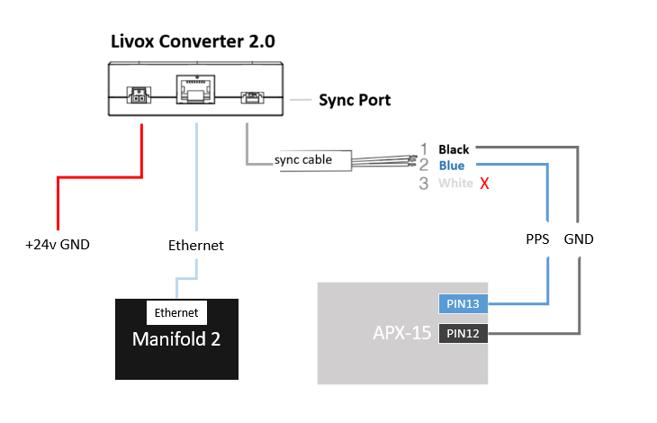
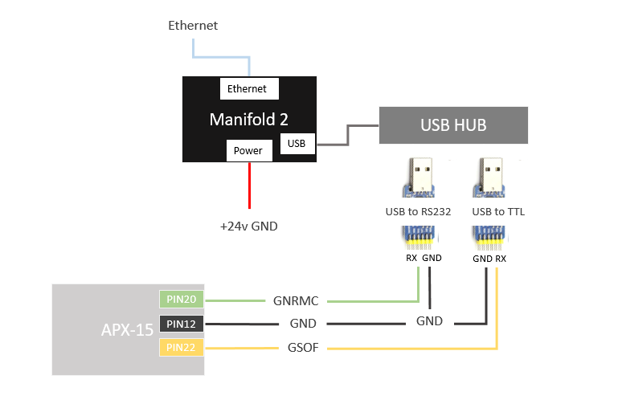
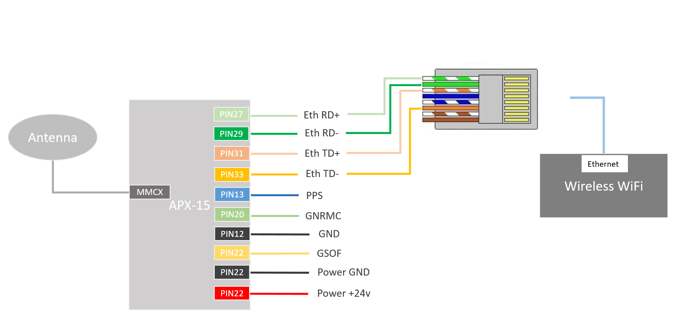
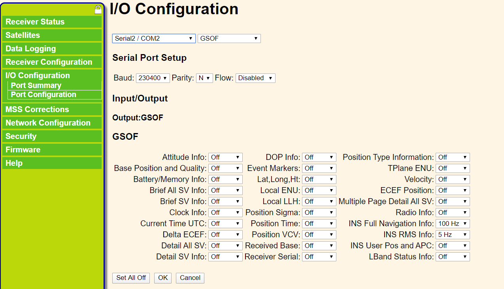
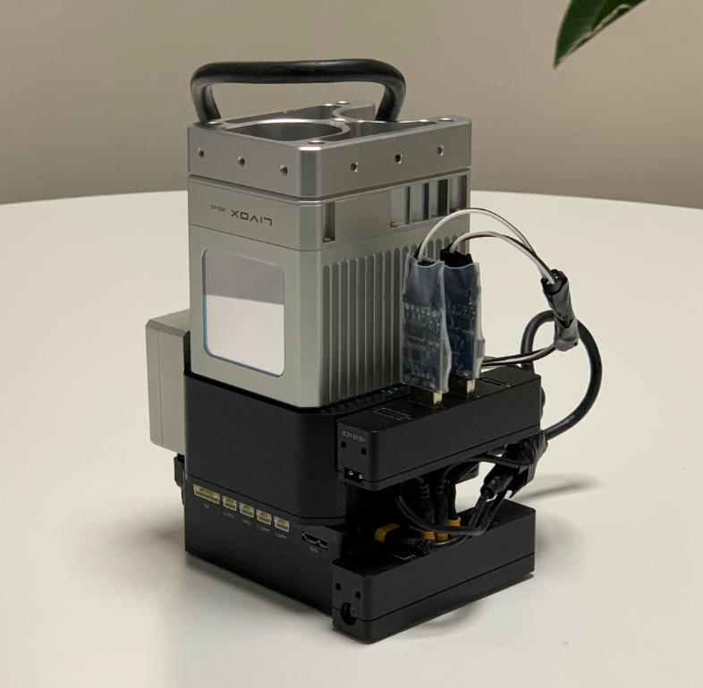
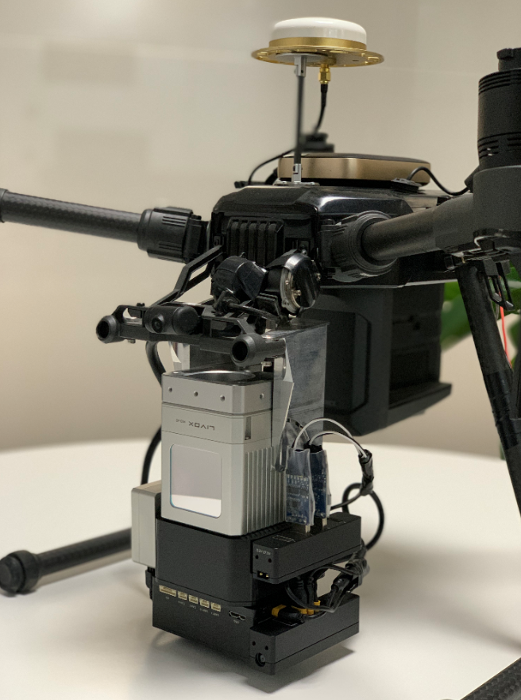

[English document](../../README.md)

## 1 系统概述

### 1.1 主要功能

使用探测距离达260m，精度2cm，非重复扫描方式的Mid-40激光雷达传感器，结合APX-15惯导模块提供的高精度位置，姿态数据，实现实时的高精度建图功能。

下图是实时的建图效果：


下图是整体效果：


### 1.2 系统框图

整个系统包含以下几个主要的模块，各模块互相的连接和数据交互如下图所示：


以上数据链路的接口和用途说明：

GNSS signal：GPS天线，给APX-15提供卫星信号；

NTRIP：网络接口，用于无线网络模块和APX-15之间交互网络RTK服务的NTRIP数据；

PPS：TTL电平接口，给Mid-40提供硬件时间同步信号；

Point Data：Manifold和Livox转接盒通过网口，传输Mid-40的点云数据；

GNRMC：USB转RS232电平，接入Manifold，给Mid-40提供每次PPS脉冲对应的时间信息；

GSOF：USB转TTL电平，接入Manifold，传输APX-15输出的姿态、位置数据；

Power：使用24v直流电源，给Manifold、Mid-40、APX-15供电；

## 2 系统搭建

下面将介绍如何完成搭建整个系统的硬件，并完成相关模块的配置。

### 2.1 硬件列表

首先需要准备如下的几个硬件模块，备注中有相关产品的说明和链接。

| 名称               | 数量 | 备注                                                         |
| ------------------ | ---- | ------------------------------------------------------------ |
| APX-15             | 1    | [APX-15 UAV](https://www.applanix.com/products/dg-uavs.htm)  |
| GNSS天线           | 1    | 支持频段：GPS+GLONASS+BeiDou+Galileo                         |
| USB转TTL/RS232模块 | 2    | 支持USB转TTL电平或RS232电平，[CP2102多功能模块](https://detail.tmall.com/item.htm?spm=a1z10.3-b-s.w4011-16538328900.25.69553d6c5zYQpq&id=41297073849&rn=4082524dc57b58372596ac3cccfd4555&abbucket=11) |
| Manifold 2         | 1    | NVIDIA Jetson TX2核心，[Manifold 2-G](https://www.dji.com/cn/manifold-2) |
| Mid-40             | 1    | 推荐使用短连接线版本，[Mid-40](https://www.livoxtech.com/cn/mid-40-and-mid-100) |
| Livox转接盒2.0     | 1    | 9~30v电源输入，TTL电平同步接口，非Mid-40原装转接盒，[Horizon产品中附带](https://www.livoxtech.com/cn/horizon) |
| 无线网络模块       | 1    | 连接室外3G/4G信号，带RJ45接口，[华为WiFi 2 Pro](https://consumer.huawei.com/cn/routers/mobilewifi2pro/) |

*备注：*

- USB转TTL/RS232模块：因为APX-15的COM1输出的信号为RS232电平，COM3输出的信号为3.3v TTL电平，所以分别需要一个USB转TTL模块和一个USB转RS232模块；
- Manifold 2：可以使用其他的小型miniPC替代，如果要安装在多旋翼飞机上，需要考虑供电和重量；
- Mid-40：因为整个系统需要紧凑的组装在一起，推荐使用短连接线版本的Mid-40，购买短线版本需要联系Livox官方销售人员；
- **Livox转接盒2.0**：如果使用Mid-40自带的转接盒（Livox转接盒1代，10~16v电源输入，485电平同步接口），需要使用DC-DC模块将24v的供电电压转换到12v，且需要TTL转接485电平的模块，将APX的PPS信号转换成485电平后接入同步接口。Livox转接盒2.0为Horizon/Tele产品中附带的模块，如单独购买需要联系Livox官方销售人员；
- 无线网络模块：给APX提供网络RTK的连接服务，因为APX使用有线以太网接口，所以网络模块需要带RJ45有线接口；

### 2.2 连接和配置

整个系统有3个核心的模块，分别是：

1. Mid-40
2. Manifold/miniPC
3. APX-15

下面将介绍它们在整个系统中的线路连接，以及功能配置。

#### 2.2.1 Mid-40

Livox转接盒一端连接Mid-40，另一端有3个接口：

供电：连接24v电源；

网口：网线连接Manifold 2；

同步接口：同步信号线的蓝色连接APX的PPS信号输出端口(PIN13)，黑色连接APX的GND端口(PIN12)；



#### 2.2.2 Manifold/miniPC

供电：连接24v电源；

网口：网线连接Livox转接盒2.0；

USB to RS232模块：RS232 Rx端连接APX-15的COM1 Tx(PIN20)，RS232 GND连接APX-15的GND(PIN12)；

USB to TTL模块：TTL Rx端连接APX-15的COM3 Tx(PIN22)，TTL GND连接APX-15的GND(PIN12)；



#### 2.2.3 APX-15

MMCX接口：连接GNSS天线

PIN12：GND

PIN13：输出PPS信号

PIN20：COM1 Tx，输出GNRMC数据

PIN22：COM3 Tx，输出GSOF的INS Full Navigation Info数据

PIN27/29/31/33：RJ45有线网络接口，用于传输网络RTK服务数据

PIN42：电源GND

PIN44：电源+24v输入



为了使APX-15的COM1能输出GNRMC数据，COM3能输出GSOF数据，需要在APX-15的管理界面（通过浏览器登陆），配置对应IO输出数据的类型和频率。同时为了使用网络RTK服务，需要在对应页面添加网络RTK服务的NTRIP client账号。

COM1输出配置：


COM3（在管理界面显示为COM2）输出配置：



添加NTRIP client账号：


### 2.3 组装和调试

按照上述的介绍，完成对应的硬件线路连接和接口配置后，将各个模块按照如下的方式尽可能紧凑的安装在一起：



装配中的imu和LiDAR之间的相对坐标：


安装在飞机上的效果图：



如上图所示的实际安装，因为LiDAR和imu安装的比较近，我们没有配置它们之间的平移参数，但imu和GNSS天线之间距离较远，我们需要配置这个平移参数：


## 3 软件使用

### 3.1 下载和安装

以下测试基于Ubuntu 64-bit 16.04环境。

1、安装[Livox SDK](https://github.com/Livox-SDK/Livox-SDK)和[livox_ros_driver](https://github.com/Livox-SDK/livox_ros_driver)，如已安装，可以跳过此步骤：

```
# 安装Livox_SDK
git clone https://github.com/Livox-SDK/Livox-SDK.git
cd Livox-SDK
sudo ./third_party/apr/apr_build.sh
cd build && cmake ..
make
sudo make install

# 安装livox_ros_driver
git clone https://github.com/Livox-SDK/livox_ros_driver.git ws_livox/src
cd ws_livox
catkin_make
```

2、安装PCL，Eigen依赖：

- [PCL 安装](http://www.pointclouds.org/downloads/linux.html)
- [Eigen 安装](http://eigen.tuxfamily.org/index.php?title=Main_Page)

3、安装[livox_high_precision_mapping](https://github.com/Livox-SDK/livox_high_precision_mapping)：

```
cd ws_livox/src
git clone https://github.com/Livox-SDK/livox_high_precision_mapping.git
cd ws_livox
catkin_make
source ./devel/setup.sh
```

### 3.2 软件配置

**雷达配置**

在 [livox_ros_driver/config/livox_lidar_config.json](https://github.com/Livox-SDK/livox_ros_driver/blob/master/livox_ros_driver/config/livox_lidar_config.json) 文件中，在`broadcast_code`中添加Mid-40的SN号，其余的配置如下：

```
    "lidar_config": [
        {
            "broadcast_code": "your device SN",
            "enable_connect": true,
            "enable_fan": true,
            "return_mode": 0,
            "coordinate": 0,
            "imu_rate": 0,
            "extrinsic_parameter_source": 0
        }
    ],
```

**端口配置**

将上述的硬件连接好后，Manifold 2的 `/dev/` 目录下会多出两个设备，如：

```
/dev/ttyUSB0
/dev/ttyUSB1
```

找到发送GSOF数据和GNRMC数据的对应的设备名，假设 `/dev/ttyUSB0` 为GSOF数据，`/dev/ttyUSB1` 为GNRMC数据。

在 [gnss_module/apx15/launch/apx15.launch](gnss_module/apx15/launch/apx15.launch) 文件中，配置参数port为/dev/ttyUSB0，baud为230400：

```
    <param name="port" value="/dev/ttyUSB0" />
    <param name="baud" value="230400" />
```

在 [livox_ros_driver/config/livox_lidar_config.json](https://github.com/Livox-SDK/livox_ros_driver/blob/master/livox_ros_driver/config/livox_lidar_config.json) 文件中，配置参数enable_timesync为true，device_name为/dev/ttyUSB1，baudrate_index为6（对应波特率115200）：

```
    "timesync_config": {
        "enable_timesync": true,
        "device_name": "/dev/ttyUSB1",
        "comm_device_type": 0,
        "baudrate_index": 6,
        "parity_index": 0
    }
```

### 3.3 运行

Livox-Mapping是为Livox激光雷达准备的建图程序，该工程通过使用rtk/imu信息，将LiDAR输出的信息拼接在一起形成完整的点云。

- 首先修改livox_mapping.launch文件中的map_file_path value，设置你的点云保存路径；

- 如果使用了和本文档描述不同的坐标系关系，请注意修改livox_mapping_case.cpp中的外参选项；

- 如果使用了和本文档描述不同的LiDAR数据频率100Hz，请注意修改livox_mapping_case.cpp中的lidar_delta_time选项；

#### 3.3.1 在线建图

直接运行mapping_online.launch文件，生成融合imu姿态，gnss位置的pointCloud2格式点云数据：

```
roslaunch livox_mapping mapping_online.launch
```

#### 3.3.2 离线建图

在 apx_lidar_raw.launch 中，设置`rosbag_enable`为true，配置bag文件存储路径，运行后会自动存储imu、gnss、点云，这三种原始数据。

```
roslaunch livox_mapping apx_lidar_raw.launch
```

当采集完数据后，运行 livox_mapping.launch，完成离线建图。

```
#播放上面记录的rosbag文件
rosbag play xxxxxxx.bag
#运行mapping程序
roslaunch livox_mapping livox_mapping.launch
```

### 3.4 数据格式

imu数据格式sensor_msgs::Imu，包含四元数，roll，pitch，yaw数据及对应的精度，x/y/z的角速度、加速度数据。

```
#geometry_msgs/Quaternion orientation
    float64 x
    float64 y
    float64 z
    float64 w

#float64[9] orientation_covariance
    float64[0]              # roll,  unit: degree
    float64[1]              # pitch, unit: degree
    float64[2]              # yaw,   unit: degree
    float64[3]              # roll  RMS, unit: degree
    float64[4]              # pitch RMS, unit: degree
    float64[5]              # yaw   RMS, unit: degree

#geometry_msgs/Vector3 angular_velocity
    float64 x               # unit: rad/s
    float64 y               # unit: rad/s
    float64 z               # unit: rad/s

#geometry_msgs/Vector3 linear_acceleration
    float64 x               # unit: m/s^2
    float64 y               # unit: m/s^2
    float64 z               # unit: m/s^2
```

导航位置数据格式sensor_msgs::NavSatFix，包含GPS和IMU状态，latitude，longitude，altitude数据及对应的精度数据。

```
#sensor_msgs/NavSatStatus status
    int8 status             # apx GPS status
    uint16 service          # apx IMU status

float64 latitude            # unit: degree
float64 longitude           # unit: degree
float64 altitude            # unit: m

#float64[9] position_covariance
    float64[0]              # North Position RMS, unit: m
    float64[1]              # East  Position RMS, unit: m
    float64[2]              # Down  Position RMS, unit: m
```
